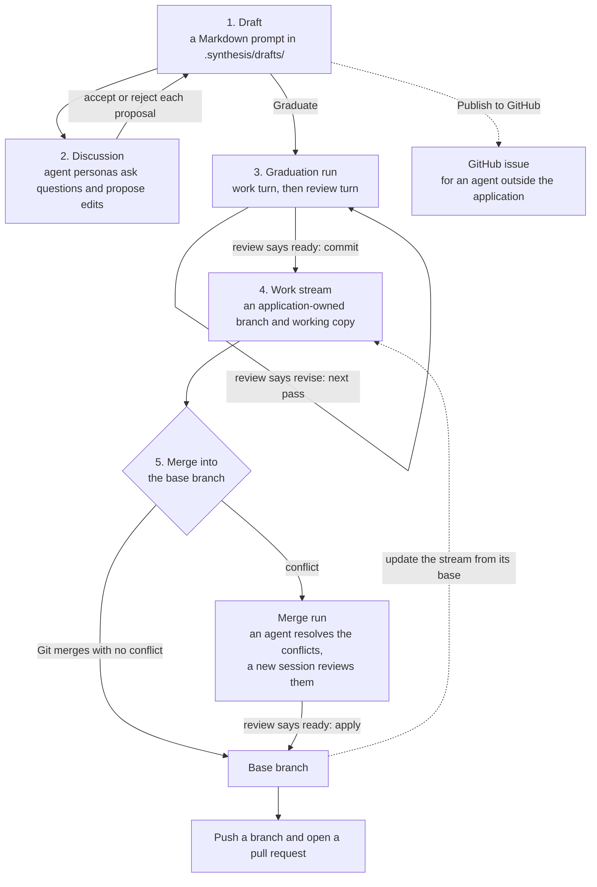
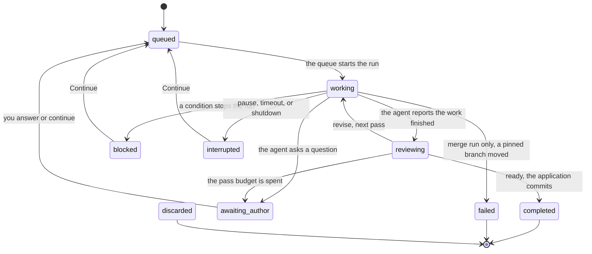

# Synthesis

Synthesis is an IDE for software engineers working with AI in a spec-driven way.

### How to use it

Engineer writes a draft of a feature/change/requirement as a prompt. AI agent personas read it, ask questions, and propose edits. Engineer brainstorms it with AI agent personas. When the draft is ready, engineer may **graduate** it. Then your coding agent (e.g. Claude Code or Codex) does the work using the skills defined in the repository in a Docker container on a Git branch. A second agent session reviews the result.  This loop repeats until reviewer is happy.

### What it is not

It’s not a harness. It’s not a framework. It’s not a decision maker. It’s not a replacement for any skills that engineer have defined in his repository.

And it’s not a replacement for the IDE where engineer can write everything manually.

### What is included

Synthesis is a Tauri 2 application. The user interface uses React 19 and TypeScript. The backend uses Rust.

You bring your own AI API keys, subscriptions. You bring the intelligence.

## Status

Synthesis is in early development. The version is 0.1.0.

- The application is for one author on one computer.
- There are no signed builds and no published releases. You build it from source.
- The reference agent images are not published. Each project names its own agent image.
- Some functions are not complete. The list of known gaps is in `docs/README.md`.

## Development lifecycle

Work in Synthesis moves through five stages. Each stage keeps its data in Git, in the application data directory, or in `~/.synthesis/`. Thus you can stop and continue later.



### 1. Draft

A draft is one Markdown prompt. You create it in a **New Artifact** tab. The application keeps the draft in `.synthesis/drafts/` in your repository and commits it to Git. A draft can contain images. When you accept a proposal, the draft history keeps the prompt before and after the change, so you can read and compare earlier versions.

### 2. Discussion

Type the nickname of an agent persona in a comment, for example `@critic`. Type `@all` to ask all the personas of the project. The persona answers in the discussion of the draft or of a selected passage. A persona can ask a set of multiple-choice questions. It can also propose edits to the prompt. The document shows each proposal as a change. You accept or reject it. The prompt changes only when you accept a proposal.

### 3. Graduation

When the prompt is complete, click **Graduate**. The application locks the draft, keeps a copy of the prompt, and adds a **graduation run** to a queue. The run does one or more **passes**. A pass has two turns:

1. A **work turn**. An execution agent (Claude Code or Codex) does the task in a Docker container. The agent can write only to the working copy of the run. It can read the Git history of the repository, and it can use the network.
2. A **review turn**. A new agent session examines what the work turn wrote and answers `ready` or `revise`.

After a `ready` review, the application commits the result. A `revise` review with only one or two small findings also counts as `ready`. Another `revise`review starts the next pass. The **pass budget** of the project sets the maximum number of passes. If you set no budget, the maximum is two. If the agent needs an answer from you, the run stops in `awaiting_author` until you answer.



The diagram is simplified. For example, a review turn can also ask a question, stop on a blocker, or stop on a pause. You can discard a run from every state except `completed`. Only a merge run can fail. It fails when its stream branch or its base branch moves. `completed`, `discarded`, and `failed` are final states. The full rules are in `specifications/core/GRD-graduation.md`and `specifications/ai/GRL-graduation-loop.md`.

A run works in one of three places:

- **A work stream.** This is the usual place. The run works in the working copy of the stream and commits on the branch of the stream.
- **A direct run.** The run works in the worktree that was active when you confirmed it, on the branch that worktree had at that time.
- **A merge run.** The run works in an isolated worktree that it owns. See stage 5.

### 4. Work stream

A work stream is a named branch and working copy that the application owns. A stream lives longer than one run. The runs of one stream use one queue. Each run starts from the commit of the run before it. Thus all the runs of a stream use one history.

You examine a stream in the **Changes** panel and the diff viewer. When the base branch moves, you can update the stream from its base branch. An update can stop to ask you a question.

### 5. Merge

When the work on a stream is complete, you merge the stream into its base branch. Both sides must have no uncommitted changes. Git tries the merge first. A merge with no conflict completes at once, with no run.

If Git cannot resolve a conflict, the application starts a **merge run** with the name `Merge <stream name>`. An agent resolves the conflicts in an isolated worktree, and a new agent session reviews the result. After a `ready` review, the application applies the result to the base branch. It makes a merge commit, or it puts the changes in the worktree of the base branch with no commit. You select one of the two.

You can then push a branch and open a pull request for it in the **Git** panel.

### Work from GitHub

You can publish a draft as a GitHub issue. Then an agent outside Synthesis can do the work.

The **Git** panel can also show the tasks with the status "Ready" in a GitHub Project. When you claim a task, Synthesis makes a draft from the issue. You graduate this draft as usual.

## Key concepts

| Concept | Meaning |
| --- | --- |
| Project | A Git repository. Synthesis keeps its project data in the `.synthesis/` directory of the repository. |
| Artifact | A file with a type: Skill, Agent, Prompt, Spec, Flow, Instructions, Scenario, or Scratchpad. The path of the file sets the type, and you can override it. |
| Draft | One Markdown prompt that you develop before the work it describes exists. |
| Discussion | One conversation about a passage, a file, a draft, or a note. You can lock a discussion and resolve it. |
| Agent persona | An AI agent that you talk to. It has a nickname, a title, a model, and optional instructions. You define it once and enroll it in a project. |
| Proposal | An edit that an agent proposes. You accept or reject it. |
| Graduation run | The queued job that turns a draft into committed work. |
| Work stream | A branch and working copy that the application owns and that many runs share. |
| Flow | A visual graph of prompts and artifacts. In this version you can edit and validate a flow, but you cannot run it. |
| Note | A short note (1 KiB maximum) on an artifact, a flow, or the project. |

## What you need to use it

- **Docker.** Every graduation turn runs in a container. Synthesis uses the `docker` command or the Docker Engine API. You select one in the global settings.
- **An agent image for each project.** The project names it in `.synthesis/project.toml`. The reference Dockerfiles are in `docker/agent-images/`.
- **An AI API for discussions.** Synthesis supports OpenRouter, Anthropic, OpenAI, and a custom gateway. You give a base URL, an API key, and a model.
- **A coding agent for graduation.** Install its CLI on your computer. Synthesis runs the CLI once to verify it.
  - Claude Code: an OAuth token for a subscription, or the base URL and token of your own gateway.
  - Codex: your existing Codex login. Synthesis mounts your Codex home directory into the container.
- **A GitHub token (optional).** It is necessary for pull requests, issues, GitHub Project tasks, and Git operations over HTTPS. The GitHub functions work only with github.com.

Synthesis keeps all secrets in one entry of the operating-system keyring. It does not write secrets to its settings files.

## Build from source

You need:

- Node.js and pnpm 10 or later. The CI pipeline uses Node.js 26 and pnpm 11.
- The Rust toolchain that `src-tauri/rust-toolchain.toml` pins (channel `1.88`).
- The system packages for Tauri on your operating system. The list for each host is in `docs/development.md`.
- Optional: the [Task](https://taskfile.dev) runner, Python 3, and Docker.

Run the application in development mode:

```bash
pnpm install
pnpm tauri dev
```

Build a bundle for your operating system. Then run all the checks of the CI pipeline:

```bash
task build
task tests
```

The full reference for each task is in `docs/development.md`.

## Repository layout

| Path | Contents |
| --- | --- |
| `src/` | The user interface: React 19, TypeScript, and Vite. |
| `src-tauri/` | The desktop backend: the Rust crate `synthesis_lib`. |
| `server/` | An optional standalone Rust service: an application service and a relay for remote clients. |
| `docker/agent-images/` | The reference container images for Claude Code and Codex. |
| `resources/` | Built-in prompts for the agent loops, and the flows of this project. |
| `specifications/` | The specifications. They are the source of truth for all behavior. |
| `tools/` | The specification checker and a mock agent CLI for tests. |
| `api/` | The OpenAPI description of the server. |
| `fixtures/` | Test fixtures that the frontend and the backend share. |
| `docs/` | The architecture and development documentation. |
| `.synthesis/` | The Synthesis data of this repository. The project uses its own application. |

## How we develop this project

In this project, the specification comes before the code.

1. A change starts as a specification in `specifications/`. The folders are `ui/`, `core/`, `ai/`, `tools/`, `server/`, and `infra/`. Each specification has a three-letter code, and each requirement has an identifier such as `TSK-FR-28`.
2. The code implements the specification. Code comments and test names cite the identifiers of the requirements that they implement or verify.
3. `task specs` checks that every cited identifier exists in a specification.

The repository contains two Claude Code skills for this process, in `.claude/skills/`: `analyst` writes and changes specifications, and `engineer` implements them. All documentation uses Simplified Technical English (ASD-STE100). The rules for contributors and agents are in `CLAUDE.md`.

## Documentation

- `docs/README.md`: the architecture.
- `docs/development.md`: the build, test, and check commands.
- `server/README.md`: the server.
- `docker/agent-images/README.md`: the agent images.
- `tools/agentic-cli-mock/README.md`: the mock agent CLI.

## License

Synthesis is licensed under the [Apache License 2.0](LICENSE).