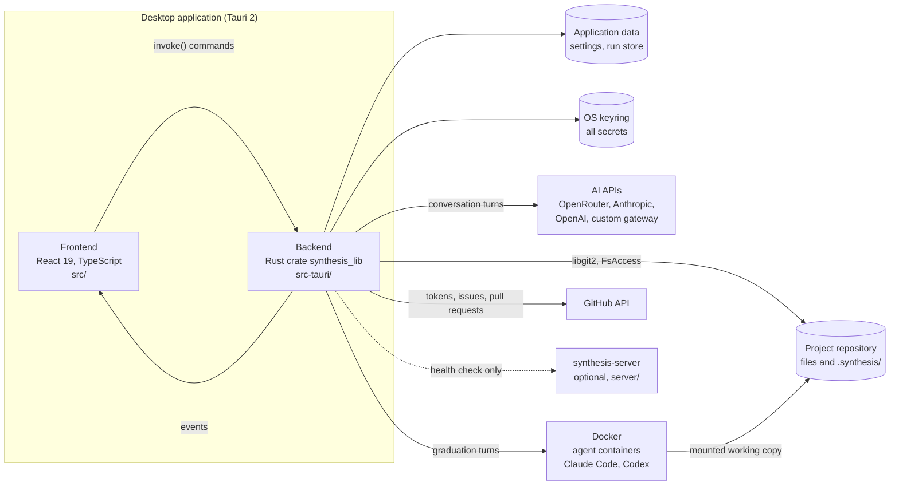
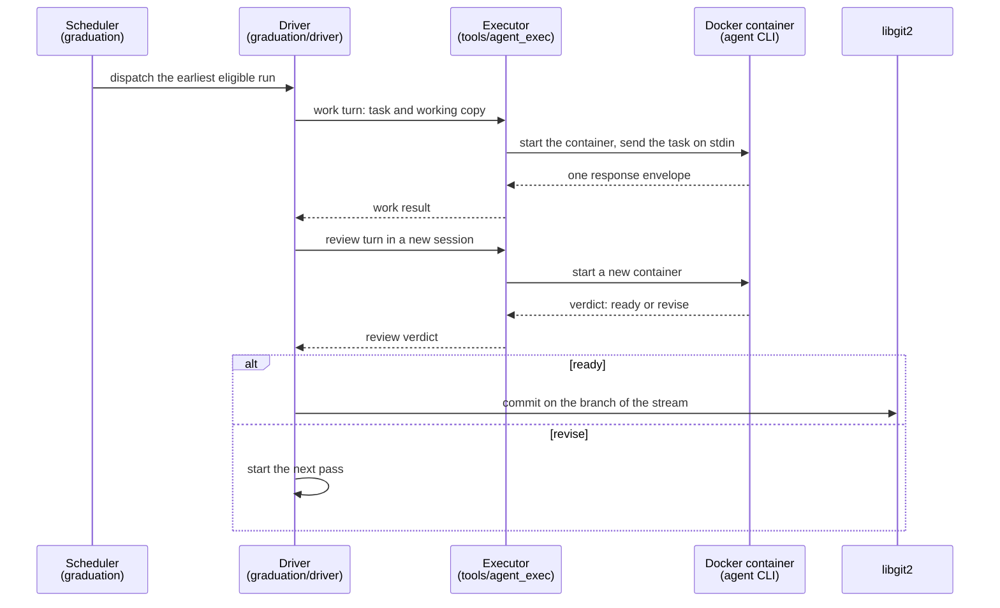

# Architecture

This document gives an overview of the Synthesis architecture. For the
product and the development lifecycle, read the root [`README.md`](../README.md).
For the build and test commands, read [`development.md`](development.md).

The specifications in [`specifications/`](../specifications/) are the source of
truth for all behavior. This document names the specification that owns each
part. Most Rust modules also name their specification in their first comment.

## System overview

Synthesis has two parts. The frontend runs in the webview. The backend is the
Rust crate `synthesis_lib`, and the small `main.rs` binary starts it. The frontend has no direct access to the disk, to
Git, or to the network. It sends all requests to the backend with `invoke()`,
and the backend sends updates back as Tauri events.

## Components

| Path | Component |
| --- | --- |
| `src/` | The frontend. One entry point, `src/main.tsx`, starts the main window or one of the two settings windows. |
| `src-tauri/` | The backend crate `synthesis_lib`, and a small `main.rs` binary. |
| `server/` | `synthesis-server`, a standalone Axum service. It shares no code with `src-tauri/`. See [`server/README.md`](../server/README.md). |
| `docker/agent-images/` | The reference images for Claude Code and Codex, and `manifest.toml`. See [`docker/agent-images/README.md`](../docker/agent-images/README.md). |
| `tools/agentic-cli-mock/` | A test executable that acts as an agent CLI and plays recorded scenarios. |
| `tools/spec-check/` | A Python script that checks the specification corpus and every citation of a requirement identifier. |
| `resources/prompts/` | The prompts of the conversation loop and the graduation loop. The backend compiles them in with `include_str!`. |
| `resources/flows/` | The flow documents of this project. |
| `fixtures/flows/` | Flow documents that the TypeScript serializer and the Rust validator both read, so the two stay in agreement. |
| `api/openapi.yaml` | The OpenAPI 3.1 description of the server REST API. |
| `specifications/` | The specifications, in six categories: `ui/`, `core/`, `ai/`, `tools/`, `server/`, and `infra/`. See [`specifications/TEMPLATE.md`](../specifications/TEMPLATE.md). |

## Backend

### Commands

Each Tauri command is a `#[tauri::command]` function in the module of its
domain, for example `src-tauri/src/graduation/commands.rs`.
[`src-tauri/src/lib.rs`](../src-tauri/src/lib.rs) does not hold command logic.
It does these tasks:

- It declares the modules.
- It registers the managed state of each domain with `.manage(...)`.
- It sets up filesystem access, the native menu, and the timers.
- It registers all commands (about 250) in one `tauri::generate_handler![...]`
  call.

[`command_names.rs`](../src-tauri/src/command_names.rs) holds the list of all
command names, and `lib_tests.rs` checks that list against the registration.

Most code that uses an external system is behind a trait. The code calls these
traits "seams", for example `DockerRuntime` and `CliRunner`. The tests
replace a seam with a fake, so most backend tests run without Docker, Git
remotes, or the network.

### Modules

| Group | Modules | Purpose |
| --- | --- | --- |
| Foundation | `fs`, `logging`, `progress`, `notifications`, `menu`, `window`, `settings_window`, `dialog`, `fonts`, `layout` | Disk access, the session log, status reports, and native windows and menus. |
| Project and settings | `project`, `worktree`, `settings`, `global_settings`, `project_settings`, `storage_floor`, `repository_store`, `secret_vault`, `github_tokens`, `docker`, `relay_endpoint` | Open and close a project, select the active worktree, and keep settings and secrets. |
| Library and editor | `scanning`, `library`, `artifacts`, `watcher`, `draft_watcher`, `flow_validation`, `search`, `bm25_index`, `skills`, `dashboard` | Find and classify artifacts, read and save files, watch for changes, and search. |
| Drafts | `drafts`, `draft_history`, `draft_proposals`, `prompt_proposals`, `draft_assets`, `statistics`, `comments`, `notes` | Draft storage, versions, proposals, images, discussions, and notes. |
| AI | `ai_api`, `ai_openrouter`, `ai_shared`, `agents`, `agent_conversations`, `tools`, `agentic`, `agent_activity`, `prompts` | AI providers, agent personas, conversation turns, model tools, and agent CLI integrations. |
| Graduation and Git | `graduation`, `streams`, `git`, `changes` | The run queue and state machine, work streams, and all Git operations. |
| GitHub | `github_publication`, `github_polling` | Publish a draft as an issue, and claim ready tasks from GitHub Projects. |

## Frontend

| Path | Purpose |
| --- | --- |
| `src/api/` | Typed wrappers for the backend commands, one file for each area. These files are the only code that calls `invoke()`. |
| `src/events.ts` | The names of all backend events, in one place. |
| `src/components/` | The user interface components: the editor, the flow canvas, the diff viewer, the panels, and the settings sections. |
| `src/hooks/` | React hooks. `src/hooks/shell/` holds the shell actions: open, save, create, navigate, and close tabs. |
| `src/state/` | State modules and reducers. |
| `src/diff/` | Line, word, Markdown, and flow diffs. |
| `src/types/` | TypeScript copies of the Rust wire types. |
| `src/test/` | The Vitest setup, shared fixtures, and checks that the frontend and the backend stay in agreement. |

The frontend uses no external state library. It uses React state and hooks, and
small stores built on `useSyncExternalStore`. The editor uses TipTap 3, which is
based on ProseMirror, with a Markdown source mode.

## Runtime flows

### Open a project

1. The project picker calls `open_project_at_path`.
2. The backend finds the repository and the active worktree, and adds the
   project to the recent projects.
3. The backend sets the allowed roots of `FsAccess` (see
   [Security boundaries](#security-boundaries)).
4. The backend starts the file watchers and scans the project for artifacts.

A change of the active worktree goes through `worktree::activate_worktree` and
does these steps again for the new root.

### Conversation turns

An agent persona answers through a direct HTTP call to the AI provider. The
`agent_conversations` module holds the loop and uses `rig-core` (or
`openrouter-rs` for OpenRouter). The model can use the tools in
`src-tauri/src/tools/`. With these tools, it can search specifications, drafts,
notes, and skills. It can read files, search and read web pages, propose
changes, and ask the author questions. Owner: [`specifications/ai/CVL-conversation-loop.md`](../specifications/ai/CVL-conversation-loop.md).

### Graduation

The development lifecycle is in the root
[`README.md`](../README.md#development-lifecycle). This diagram shows one pass of
a graduation run inside the backend.

The executor ([`specifications/tools/EAC-execute-agent-cli.md`](../specifications/tools/EAC-execute-agent-cli.md))
is not a model tool. Only graduation runs and the semantic rebase of a stream
update call it. It runs the image that
the project names in `.synthesis/project.toml` under `[dockerImages.<vendor>]`.
It has no fallback image. It runs only the `claude_code` and `codex` vendors.

Owners: [`specifications/core/GRD-graduation.md`](../specifications/core/GRD-graduation.md),
[`specifications/ai/GRL-graduation-loop.md`](../specifications/ai/GRL-graduation-loop.md),
[`specifications/core/WKS-work-streams.md`](../specifications/core/WKS-work-streams.md).

### Git

All Git operations use `git2` (libgit2) with the HTTPS and SSH transports. The
application never starts the `git` command. Push sends its output to the
frontend as events.

## Persistence

| Location | Contents | Format |
| --- | --- | --- |
| `<data dir>/synthesis/synthesis.toml` | The global settings: preferences, recent projects, plugins and adapters, AI providers, agent integrations, agent personas, GitHub token records, the Docker backend, the relay endpoint, and the per-project layout. It holds no secrets. | TOML |
| `<data dir>/synthesis/repositories/<slug>-<digest>/` | Data for one repository that stays out of Git: discussion logs, draft statistics, and `repository.toml`. | JSONL, TOML |
| `<data dir>/synthesis/agent-activity/` | The activity record of each agent CLI run. | JSONL |
| `<data dir>/synthesis/agent-sessions/` | The session state of the vendor CLIs, so that a turn can continue an earlier session. | vendor format |
| `~/.synthesis/` | The graduation store: queues, run records, run logs, stream update records, merge attempts, and the worktrees of work streams and merge runs. The path is short and has no spaces, because a container uses the same path and the agent types it in its commands. | TOML, JSONL |
| OS keyring | One entry that holds all secrets as one JSON object. | JSON |
| `<repository>/.synthesis/project.toml` | Committed project settings, for example the draft template and the agent images. | TOML |
| `<repository>/.synthesis/library.toml` | Committed artifact-type overrides. | TOML |
| `<repository>/.synthesis/local.toml` | Panel state for this machine. Git ignores it. | TOML |
| `<repository>/.synthesis/drafts/` | The drafts. Git ignores their history, proposals, publication records, and conversation logs. | TOML, Markdown, JSONL |
| `<repository>/.synthesis/proposals/` | Proposals for prompt files of the project. Git ignores them. | TOML, text |
| `<repository>/.synthesis/notes/` | The notes. | TOML |

`<data dir>` is the data directory of the operating system, for example
`~/Library/Application Support` on macOS. The session log stays in memory only.

## Security boundaries

- **Tauri capabilities.**
  [`src-tauri/capabilities/default.json`](../src-tauri/capabilities/default.json)
  sets what the main window can call. `settings-windows.json` gives the two
  settings windows a smaller set.
- **Filesystem.** All backend disk access goes through `FsAccess` in
  [`src-tauri/src/fs/`](../src-tauri/src/fs/). It accepts only absolute paths
  below its allowed roots. The main instance has four roots: the active
  worktree, the application data directory, `~/.synthesis/`, and a temporary
  directory for the session. An agent session gets only the worktree and its
  own temporary directory. `FsAccess` removes `..` from a path and then refuses
  the path if it is out of the roots. It refuses symbolic links. It replaces
  files atomically.
- **Secrets.** Secrets stay in the OS keyring. The frontend receives only a
  masked hint, for example the last four characters of a token.
- **Agent containers.** Each turn runs in a new container with `--rm`,
  `--cap-drop ALL`, `--security-opt no-new-privileges`, and the user ID of the
  host user. The executor mounts the working copy at the same path as on the
  host. It uses `/workspace` only when the container cannot use the host path.
  The executor mounts the Git metadata of the repository read-only. The images
  contain Git, so that an agent can read the history, but the host makes all
  commits. The token of Claude Code goes to the container as an environment
  variable, never in the command line.
- **Server.** All routes except `GET /v1/health` need a static bearer token.

## Build, test, and CI

- [`Taskfile.yaml`](../Taskfile.yaml) holds the eight tasks. The reference is in
  [`development.md`](development.md).
- [`.github/workflows/ci.yml`](../.github/workflows/ci.yml) runs on each pull
  request. It has five lanes: frontend, backend, mock CLI, server, and
  specifications. The `gate` job is the only check that must pass. It fails
  when a lane fails, stops before it completes, or does not run.
- [`.github/workflows/server-image.yml`](../.github/workflows/server-image.yml)
  runs when you publish a GitHub release. It builds the server image for
  `linux/amd64` and `linux/arm64` and pushes it to the GitHub container
  registry.
- No workflow publishes the desktop bundles or the agent images.

## Known gaps

These parts of the application are not complete:

- **Open from a Git URL** does not clone the repository. It opens `~/dev/<name>`
  and uses the last part of the URL as the name.
- **Create a project** does not use the selected storage mode.
- **API agent integrations.** You can configure the Claude Agent API and a
  custom agent API, but they cannot do graduation work. Only Claude Code and
  Codex can.
- **Remote sessions.** The desktop application only checks the health of the
  server. It has no relay worker yet. The server keeps all records in memory.
- **Agent images.** The digests in `docker/agent-images/manifest.toml` are
  placeholders. The reference images are not published.
- **Flows.** You can edit and validate a flow, but you cannot run it.
- **Pull.** The application can push and fetch. It has no pull operation yet.
- **Webview content security policy.** `src-tauri/tauri.conf.json` sets
  `"csp": null`.
